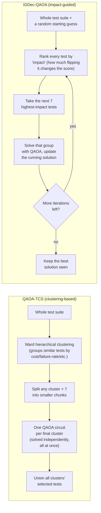
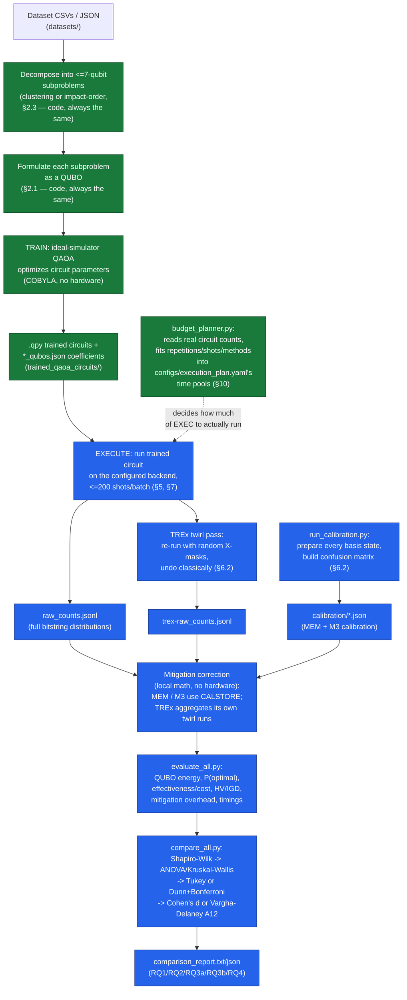

# EXPLAINATION.md — This Repository, From Scratch

> Written as a "come back after two months and understand everything again"
> document. Nothing is assumed. Where useful, a diagram or table replaces a
> wall of text. The most important section, if you only read one, is
> **§12 "What has actually been run, right now"** — everything else is
> context to make that section make sense.

---

## 0. One paragraph summary

This repo takes two existing quantum algorithms for picking a smaller,
cheaper subset of software tests to re-run after a code change
("Regression Test Case Selection"), and extends them so they can run on a
**real quantum computer** (PIAST-Q) instead of only on a computer's simulated
approximation of one. Running on real hardware introduces noise (errors),
so this repo also builds three different ways to clean up that noise
("mitigation"), a way to plan how much of the limited real-hardware time is
needed, and a way to measure and statistically compare how well everything
worked. As of today, **all of that code exists and is unit-tested, but none
of it has been run against real hardware yet** — see §12.

---

## 1. The problem this project solves (no quantum yet)

Imagine a software project with thousands of automated tests. Every time a
developer changes the code, in principle you should re-run *all* tests to
make sure nothing broke. In practice that's too slow/expensive. **Test Case
Selection (TCS)** is the problem of picking a smaller subset of tests that
still catches most bugs, instead of re-running everything.

Concretely, every test case has some attributes, e.g.:
- **execution cost** (how long/expensive it is to run),
- **failure rate** (how often it has caught a bug in the past),
- for some datasets: **statement coverage**, **input diversity**, **passenger
  count**, **travel distance** (dataset-specific — see §4).

TCS tries to pick a subset of tests that is **cheap** (low total cost) but
still **effective** (high failure-catching power / coverage). This is an
optimization problem: for `n` tests, there are `2^n` possible subsets — for
even a few dozen tests, checking every subset by hand is already impossible.

---

## 2. Turning it into something a quantum computer can solve

### 2.1 QUBO — the "shape" every solver here understands

A **QUBO** (Quadratic Unconstrained Binary Optimization) is a way of writing
an optimization problem so that:
- every decision is a single bit `x_i ∈ {0, 1}` (1 = "include this test", 0 =
  "leave it out"),
- the thing you're minimizing is a sum of terms that are each either
  `(a single x_i)` or `(x_i times x_j)` — nothing more complicated than that.

For TCS, a simple QUBO says (in words): *minimize total execution cost of the
selected tests, while also rewarding tests with a high failure rate, and
penalizing when two tests that both cover the same line of code are picked
together (redundant coverage)*. That's it — cost, effectiveness, and
redundancy, expressed purely as bit-flips and pairs of bit-flips. Every
dataset in this repo has its own QUBO formula (§4), but they're all this same
"shape."

### 2.2 QAOA — a quantum recipe for approximately solving a QUBO

**QAOA** (Quantum Approximate Optimization Algorithm) is a specific recipe
for asking a quantum computer to solve a QUBO. You don't need the quantum
mechanics to follow what happens operationally:

1. You translate the QUBO into a small quantum circuit (one qubit per
   decision bit `x_i`).
2. You run that circuit, together with a classical optimizer (`COBYLA` here),
   which repeatedly tweaks the circuit's internal parameters to make its
   output more and more likely to land on a *good* (low-cost) bitstring.
   This tweaking loop is called **training**, and it happens entirely on a
   classical computer simulating a small quantum system ("ideal simulator")
   — no real quantum hardware needed for this part.
3. Once trained, the circuit is "frozen" (its parameters fixed) and can be
   run — this time, ideally, on a **real** quantum computer — to sample
   candidate bitstrings. Each run ("shot") of the circuit returns one
   bitstring; running it many times gives you a *distribution* over
   bitstrings, and the most frequent one is treated as "the answer."

The frozen, trained circuit is saved to disk as a `.qpy` file (Qiskit's
circuit-serialization format) so it can be executed on hardware later
without re-training. Every `.qpy` file in `trained_qaoa_circuits/` is exactly
this: a frozen QAOA circuit, ready to be sampled.

### 2.3 Why not just solve the whole problem at once?

A real test suite can have thousands of tests, but a QAOA circuit needs one
qubit per test case, and current/near-term quantum hardware (including
PIAST-Q) only reliably supports a handful of qubits before noise makes
results useless. This repo (like the two algorithms it implements) caps
every quantum circuit at **7 qubits** (7 test-case decisions at a time). The
big test suite is therefore broken into many small ≤7-test-case pieces,
solved separately, then recombined. *How* you break it up is exactly where
the two algorithms in this repo differ:



**QAOA-TCS**: decompose once (deterministic — the same clustering every
time), solve every cluster independently, union the results. Simple, stable,
and every cluster's circuit is reusable across repeated hardware runs.

**IGDec-QAOA**: an iterative loop — pick a random starting guess, repeatedly
re-rank tests by impact, solve the top-impact chunk, update the guess, and
repeat for several iterations, keeping the best solution ever seen. Because
the ranking depends on the *current* (evolving) guess, every subproblem's
circuit is only valid for that one specific point in that one specific
trajectory — nothing is reusable the way QAOA-TCS's clusters are. This is
why IGDec-QAOA needs vastly more circuits per dataset (§9) and why its
mitigated (MEM/M3/TREx) results can't be "re-merged" the same way raw results
are (§11, "IGDec-QAOA's final-suite metrics: raw only").

---

## 3. Single-objective vs. multi-objective

TCS can be framed two ways:

- **Single-objective**: combine everything you care about into *one* number
  to minimize (e.g., `α·cost − (1−α)·failure_rate`), and each run gives you
  **one** final selected subset. Simple to compare, simple to rank.
- **Multi-objective**: keep the objectives separate (e.g., cost, statement
  coverage, fault coverage) and instead of one winner, produce a **Pareto
  frontier** — the set of solutions where no other solution is better on
  *every* objective simultaneously (i.e., every solution on the frontier
  represents a different, defensible trade-off).

**QAOA-TCS** has both a single-objective version (`src/qaoa_tcs/single_obj.py`)
and a multi-objective version (`src/qaoa_tcs/multi_obj.py`). **IGDec-QAOA**
in this study is single-objective only (`src/igdec_qaoa/`).

The multi-objective version still solves the *same kind* of small QAOA
subproblems — the difference is only in the last step: instead of unioning
cluster results into one final list, `build_pareto_front()` looks at the
merged list of selected tests, considers every *growing prefix* of that list
as a candidate sub-suite (this specific method is called "Additional-Greedy"
in the literature), scores each candidate on all three objectives
(`-execution_cost`, `statement_coverage`, `fault_coverage` — cost is negated
so that "bigger is better" applies to all three uniformly), and keeps only
the ones no other candidate dominates on all three at once.

---

## 4. The datasets, and which algorithm/mode uses which

| Dataset | What it is | Attributes used | Used by |
|---|---|---|---|
| `gsdtsr` | Google's shared test-suite results | execution time, failure rate | QAOA-TCS single-obj, IGDec-QAOA |
| `iofrol` | ABB Robotics robot test suite | execution time, failure rate | QAOA-TCS single-obj, IGDec-QAOA |
| `paintcontrol` | ABB Robotics painting-robot test suite | execution time, failure rate | QAOA-TCS single-obj, IGDec-QAOA |
| `elevator` (o2) | Orona5 elevator scheduler tests | cost, input diversity | QAOA-TCS single-obj **only** |
| `elevator2` (o3) | same elevator tests, different attributes | cost, passenger count, travel distance | QAOA-TCS single-obj, and (see note below) IGDec-QAOA's `elevator_two`/`elevator_three` |
| `flex`, `grep`, `gzip`, `sed` | SIR benchmark C programs | execution cost, fault coverage, statement coverage | QAOA-TCS **multi-obj only** |

That's **9 distinct dataset/formulation pairs**, each usable by QAOA-TCS,
plus IGDec-QAOA running on 5 of them (the single-objective ones) — 14 total
algorithm × dataset combinations. See §9 for the full matrix with circuit
counts.

> **A naming gotcha worth knowing, verified directly against the code**: the
> "`_two`"/"`_three`" in IGDec-QAOA's `elevator_two`/`elevator_three` does
> **not** mirror QAOA-TCS's `elevator`(o2)/`elevator2`(o3) split. Both
> `loch_qaoa_elev_two_extract_circuits.py` and
> `loch_qaoa_elev_three_extract_circuits.py` use the exact same
> cost+passenger-count+travel-distance objective (`TestCaseOptimizationThree`,
> identical terms in both files) — there is **no IGDec-QAOA counterpart** to
> QAOA-TCS's input-diversity formulation at all. `elevator_three` is simply
> an independent second training run of the same formulation as
> `elevator_two`, not a third distinct objective set. Combos 13/14 in §9's
> table are both really "IGDec-QAOA, elevator, cost+pcount+dist" — just
> trained twice, independently.

---

## 5. Real hardware: PIAST-Q, and why this repo currently talks to a stand-in instead

**PIAST-Q** is the real quantum computer this whole project targets. It's
accessed through **AQT** (Alpine Quantum Technologies)'s Qiskit provider —
`qiskit_aqt_provider`'s `AQTProvider`/`AQTSampler` classes, which is the same
interface regardless of whether it points at the real machine or a
simulator. That's important: it means every script in this repo is *already
written* exactly as it would be for real hardware — only *which backend it
points at* needs to change (see §5.1).

**The hard constraint that shapes everything downstream**: PIAST-Q accepts a
maximum of **200 shots per run**. Anything more has to be split into several
runs of ≤200 shots each and combined — this is why `run_circuit_with_batching_recorded()`
(§7) exists, and why the budget planner (§10) is denominated in "batches of
200 shots, ~15 seconds each."

### 5.1 Right now: pointed at a placeholder, on purpose

`configs/backend.yaml` currently holds:

```yaml
api_token: ACCESS_TOKEN
backend_name: offline_simulator_no_noise
```

`offline_simulator_no_noise` is AQT's own local, noise-free software
simulator — useful for making sure the *code* runs correctly, but it teaches
you nothing about real quantum noise, and it costs no real hardware time.
This is intentional and temporary: to point everything at the real PIAST-Q
machine, **only this one file** needs to change (or the `PIASTQ_API_TOKEN` /
`PIASTQ_BACKEND_NAME` environment variables, which override it — useful for
keeping a real token out of version control). Every script that opens a
backend goes through one shared function,
`piastq_execution.backend_config.get_backend()`, specifically so this is a
one-file change instead of six.

---

## 6. Why quantum results need to be "cleaned up": noise & mitigation

### 6.1 The problem

Real quantum hardware makes mistakes. The specific mistake this repo focuses
on is **readout error**: you prepared/measured a qubit that was "really" in
state `1`, but the hardware reports `0` (or vice versa) some small
percentage of the time. Run a circuit many times (many shots) and you get a
*distribution* of returned bitstrings that's subtly (or not-so-subtly)
wrong compared to what a perfect, noiseless machine would have returned.

### 6.2 Three ways to fix it, compared

| Method | How it estimates the error | Extra hardware needed | Reusable across circuits? |
|---|---|---|---|
| **Raw** (no mitigation) | — | none | — (this is the baseline everything else is compared against) |
| **Full MEM** | Prepare *every* possible `n`-qubit computational basis state (`2^n` circuits, e.g. 128 for 7 qubits), measure each many times, build the full `2^n × 2^n` "confusion matrix" describing exactly how measurements get mixed up | Once per distinct qubit width/mapping — **shared across every circuit using that mapping** | Yes — calibrate once, correct any number of already-collected raw counts afterwards, no new hardware runs needed per circuit |
| **M3** | Same idea as MEM, but estimates each qubit's readout error *individually* (`2·n` circuits instead of `2^n`) instead of building the full matrix | Once per distinct qubit width — much cheaper than MEM | Yes, same as MEM |
| **TREx** (measurement twirling) | Before measuring, randomly flip each qubit with an X gate, then classically un-flip the known random pattern from the result, and average over many random patterns. This turns a *systematic* (biased) readout error into *random* (unbiased) noise that cancels out on average — without ever needing a separate calibration matrix | **None as a separate step** — but every twirl pattern is a genuinely different circuit, so **every single one requires its own real hardware run** | **No** — cannot reuse previously collected raw counts; this is the expensive one |

In plain terms: MEM and M3 are "measure the machine's mistakes once, then
mathematically undo them on any data you already have." TREx is "don't
bother measuring the mistakes separately — just run the real circuit many
times with a different random disguise each time, so the mistakes average
themselves out," at the cost of needing that many *extra* real hardware
runs, every time.

### 6.3 Why compare all three at all? (the research angle)

If MEM and M3 (which *only* ever touch readout error) already recover most
of the performance lost to noise, **and** TREx (a completely independent way
of targeting the same readout error) recovers about the same amount and no
more, that's evidence that readout error really is the dominant source of
noise for these particular circuits — plausible, since every circuit here is
shallow (only 7 qubits, `p=1` QAOA depth). If TREx recovered *much more* than
MEM/M3, that would suggest something beyond readout error (e.g. gate-level
noise) is also significant. This is exactly **RQ3a** in §11.

### 6.4 A subtlety this section glossed over — and has since been fixed: which physical qubits?

Everything above assumes the calibration circuits (for MEM/M3) and the real
QAOA/TREx circuits land on the *same* physical qubits — otherwise you'd be
correcting a circuit's counts using a confusion matrix measured on entirely
different hardware. Until recently, nothing guaranteed this: both the real
execution and the calibration circuits let the transpiler pick a physical
layout automatically, independently of each other, with no check that they
agreed.

Fixed by pinning an explicit, shared layout: `piastq_execution/qubit_layout.py`
defines, once, which physical qubits a circuit of a given width uses
(configurable in `configs/backend.yaml`'s `physical_qubits` list — defaults
to `[0..6]`), and every caller — the real execution, the TREx twirl passes,
*and* the MEM/M3 calibration circuits — now pins that exact layout via
`sampler.set_transpile_options(initial_layout=...)` before submitting
anything. This was verified end-to-end against the real
`AQTSampler`/`offline_simulator_no_noise` stack with a deliberately
non-default layout (physical qubits `[3, 4]` instead of `[0, 1]`), not just
in a synthetic unit test.

### 6.5 A second gap this section didn't mention: the machine's *own* calibration data

MEM/M3 above are readout-error calibrations *we* measure ourselves, from
shots we run. Separately, real quantum hardware also publishes its own
characterization data — T1 (how long a qubit holds its state before
decaying), T2 (how long it holds phase coherence), per-qubit frequency, etc.
This is useful independent context for interpreting RQ3a (§6.3): if T1/T2
stayed stable across every session, that supports treating differences
between sessions as noise-mitigation effects rather than machine drift.

`piastq_execution/backend_calibration_snapshot.py` reads whatever the
backend itself reports (via the standard `qubit_properties` hook every
`BackendV2`-style backend exposes — AQT's real backend object has it, exact
population unknown until real hardware is actually used) and saves a new,
timestamped snapshot automatically at the start of every hardware-execution
script — so every real-hardware session, from the very first one onward,
gets its own dated record under `calibration/backend_snapshots/`, without
anyone having to remember to trigger it separately.

---

## 7. Raw-counts persistence — the fix that makes any of this possible

Before this round of work, every execution script threw away almost all of
its own output: it ran a circuit, took the single *most frequent* bitstring
("argmax"), and discarded the rest of the distribution. That's a dead end
for mitigation — MEM/M3/TREx all need the **full distribution** (every
bitstring and how many times it came up), not just the winner.

Now, every execution path goes through one shared function,
`piastq_execution.raw_counts.run_circuit_with_batching_recorded()`, which:

1. Runs the circuit in ≤200-shot batches (the hardware limit, §5),
2. keeps the **full** bitstring → count distribution (not just the argmax),
3. and writes one record per circuit execution containing: the full raw
   counts, a circuit/cluster/(iteration+subproblem) id, which
   algorithm/objective-mode/dataset it's from, shots requested vs. actually
   returned, which physical qubits were used, the backend's name/version,
   a timestamp, and how long the batch took.

These records are appended to a `.jsonl` file (one JSON object per line) —
`<dataset>-rep-N-raw_counts.jsonl` for the baseline, and a **separate**
`<dataset>-rep-N-trex-raw_counts.jsonl` for TREx's twirled runs (since those
are extra hardware passes, not part of the baseline — see §6.2). Existing
derived outputs (the final selected suite, subsuite/cluster assignments,
Pareto fronts) are unchanged in format — the raw counts are additional data
saved *alongside* them, not a replacement.

This is what lets MEM/M3 correction happen **after the fact**, from data
already sitting on disk, with zero additional real-hardware time.

---

## 8. The full pipeline, end to end



- 🟩 **Green** = code exists **and** has real output on disk today.
- 🟦 **Blue** = code exists, is unit-tested, but has **not actually been run**
  yet (waiting on real/placeholder hardware access on "the other machine" —
  see §12).
- 🟥 **Red** = would indicate something not yet built at all — there is
  currently nothing in that state; every stage of the pipeline has its code
  written.

---

## 9. The 14-combo matrix

| # | Algorithm | Mode | Dataset | Circuits | Status |
|---|---|---|---|---|---|
| 1 | QAOA-TCS | single | gsdtsr | 79 | ✅ trained |
| 2 | QAOA-TCS | single | iofrol | 443 | ✅ trained |
| 3 | QAOA-TCS | single | paintcontrol | 24 | ✅ trained |
| 4 | QAOA-TCS | single | elevator (o2) | 881 | ✅ trained |
| 5 | QAOA-TCS | single | elevator2 (o3) | 56 | ✅ trained |
| 6 | QAOA-TCS | multi | flex | 105 | ✅ trained |
| 7 | QAOA-TCS | multi | grep | 139 | ✅ trained |
| 8 | QAOA-TCS | multi | gzip | 61 | ✅ trained |
| 9 | QAOA-TCS | multi | sed | 77 | ✅ trained |
| 10 | IGDec-QAOA | single | iofrol | 10 samplings × 1230 | ✅ trained |
| 11 | IGDec-QAOA | single | paintcontrol | 10 samplings × 30 | ✅ trained |
| 12 | IGDec-QAOA | single | gsdtsr | *to do* | ⏳ training code ready, not run |
| 13 | IGDec-QAOA | single | elevator_o2 | *to do* | ⏳ training code ready, not run |
| 14 | IGDec-QAOA | single | elevator_o3 | *to do* | ⏳ training code ready, not run |

QAOA-TCS keeps one **reusable** circuit set per dataset (the same trained
circuits get re-run every repetition). IGDec-QAOA keeps a **fresh, one-off**
circuit set per random-initial-solution sampling (10 samplings per dataset)
— nothing is reused between samplings, which is why its circuit counts are
so much larger for the bigger datasets.

**Retraining is possible for all 14 today** — every training function lives
in this repo now (`... train` mode, §13); nothing is "ported circuits only"
anymore, even for combos 1–11 which already have circuits sitting on disk.

---

## 10. Budget planning — turning limited hardware time into a concrete plan

Real PIAST-Q time is scarce (200 shots/run, ~15 seconds/batch). Before
spending any of it, `src/piastq_execution/budget_planner.py` answers: *given
this many hours, and this many combos/methods, what repetitions/shots/methods
can I actually afford?* It reads the **real** circuit counts from
`trained_qaoa_circuits/` (nothing hardcoded) and degrades gracefully, in this
order, until the plan fits the budget:

1. Drop TREx first (it's the single most expensive method — 32 extra
   hardware passes per circuit, by default),
2. reduce repetitions,
3. reduce shots per circuit (never below one 200-shot batch),
4. as an absolute last resort, drop/subsample circuits (reported explicitly).

**The cost model itself, in full** — this is the one formula everything else
is built from: every circuit costs `ceil(shots / 200) × 15 seconds`. Shots
are requested in batches of at most 200 (the hardware limit), and *every*
batch costs ~15s regardless of how full it is — so 201 shots costs exactly
as much as 400, because it rounds up to a second whole batch. From there:
**raw** cost for a combo = (circuits × repetitions) × per-circuit cost;
**TREx** cost = that *same* raw cost again, multiplied by
`trex_twirl_instances` (32 by default, §5) — a full second (and third, and
...) set of hardware passes per circuit, not a flat surcharge; **MEM**
calibration = `2^width` circuits, **M3** = `2×width` — both charged *once
per distinct circuit width present in a pool*, shared across every combo/
repetition using that width, never per combo. Everything sums per pool; if
it exceeds the pool's hours, the four-step degradation above kicks in.

**Is there a "no-TREx" mode?** No dedicated toggle exists. TREx inclusion is
controlled entirely by whether `"trex"` appears in each combo's `methods:`
list in `configs/execution_plan.yaml` (every combo lists it by default
today). The planner always *attempts* whatever's listed at full target
quality first, and automatically drops TREx — before touching repetitions
or shots, since it's checked first as the single biggest lever — if the
pool can't afford it. So in practice it already behaves as "always included,
shut off automatically if the budget doesn't allow it." There's no flag to
force "no TREx everywhere" in one shot; that means editing every combo's
`methods:` list by hand, or trusting the automatic drop.

**The plan now actually reaches execution, not just the printed report.**
Until recently, this was purely descriptive: the plan would correctly say
"TREx dropped for X," but every execution script still hardcoded
`shots_per_batch=80, num_batches=1` and always ran the TREx loop regardless
— the plan and what would actually run on hardware were disconnected. Fixed
via `resolve_all_combo_settings()` (same module): it runs the full planner
once and returns, per combo, exactly what to execute — repetitions, shots
(pre-split into batches + remainder), methods, and a `trex_enabled` flag.
Every execution script now calls this once and uses the resolved values
instead of the old placeholder, and skips the TREx loop entirely when
`trex_enabled` is `False` rather than running it anyway. This doesn't touch
the QAOA circuit-depth `p` parameter or IGDec-QAOA's impact-reordering
iteration count — both are untouched, paper-inherited parameters, separate
from the hardware-execution repetition count this resolves.

The budget is organized into **pools** — a pool is a named time budget
(default 15h) with an explicit list of which combos share it. The shipped
`configs/execution_plan.yaml` uses **7 pools × 15h = 105h total**, one pool
per QAOA-TCS objective-mode and one pool per IGDec-QAOA dataset — but you can
just as easily make it one giant pool covering all 14 combos ("global"), or
14 separate pools of one combo each ("per_combo"): it's the same config
shape either way, just a different `pools:` list.

This has actually already been run once (safe — it only reads local `.qpy`
files, no hardware, no AQT) and produced a real report,
`execution_plan/execution_plan_report.txt`. A few real numbers from it, so
this isn't hypothetical:

```
Pool: qaoa_tcs_single_objective   Budget: 15h  Estimated: 13.65h  Fits: True
  Repetitions: 1   Shots/circuit: 248
  Dropped TREx for all 5 combos (TREx alone wasn't enough to fit; more degradation still needed)

Pool: qaoa_tcs_multi_objective    Budget: 15h  Estimated: 14.03h  Fits: True
  Repetitions: 1   Shots/circuit: 1448
  Dropped TREx for all 4 combos

Pool: igdec_qaoa_iofrol          Budget: 15h  Estimated: 10.84h  Fits: True
  Repetitions: 1   Shots/circuit: 248
  Dropped TREx (insufficient alone; repetitions/shots also had to shrink)

Pool: igdec_qaoa_paintcontrol     Budget: 15h  Estimated: 14.34h  Fits: True
  Repetitions: 10  Shots/circuit: 2048
  Dropped TREx (only method dropped — repetitions/shots stayed at target)

Pool: igdec_qaoa_gsdtsr / elevator_o2 / elevator_o3   Estimated: 0.00h
  (these combos have NO trained circuits yet — an empty inventory costs 0h,
  which is a false positive, not a real budget win, once trained circuits
  exist there TREx will very likely be dropped there too)

Summary: Total budget 105.00h, total estimated 52.86h, all pools fit.
```

**Takeaway**: even 105 hours of pooled real-hardware time isn't enough to
keep TREx everywhere at the "target" repetitions/shots — this is a concrete,
already-measured illustration of §6.2's point that TREx is expensive. If you
need TREx data for a specific combo, give it its own pool with more hours, or
lower `trex_twirl_instances` (currently 32) for that run.

### 10.0 QAOA-TCS-only feasibility at a fixed repetitions count, varying TREx strength

This is a narrower scenario than the rest of §10: a fixed set of choices,
with only one thing varied, to see exactly where the line falls.

**What's fixed in this scenario:**
- **Scope: QAOA-TCS only, 9 combos** (5 single-objective: `gsdtsr`, `iofrol`,
  `paintcontrol`, `elevator`, `elevator2`; 4 multi-objective: `flex`, `grep`,
  `gzip`, `sed`). IGDec-QAOA's 2 currently-trained combos (`iofrol`,
  `paintcontrol`) are excluded entirely from this scenario — not included at
  reduced quality, simply not considered at all.
- **Repetitions = 5.** This is how many times QAOA-TCS's (reusable) trained
  circuit set for a combo gets re-submitted to hardware — the statistical-
  robustness repeat count (§10's cost model), fixed here at 5 rather than
  the paper's own target of 10 (§16) or degraded further to 1.
- **Shots per circuit = 200**, the hardware floor — one full 200-shot batch
  per circuit, the minimum meaningful measurement, not reduced or increased
  further in this scenario.
- **Every included combo gets all four methods together**: raw + MEM + M3 +
  TREx. "Included" means the combo's full raw+MEM+M3+TREx run fits the
  budget at the fixed repetitions/shots above — not a partial run.

**What's varied: `trex_twirl_instances`, called `T` below, from 1 to 10.**
This is the number of independently-randomized measurement-twirl passes
TREx runs per circuit (§5/§6.2) — each one applies a different random
bit-flip mask right before measurement, gets undone classically, and the
results are averaged together to cancel out systematic readout bias. `T` is
*not* the same thing as repetitions: repetitions re-run the same circuit for
statistical robustness of the selection outcome; `T` is how many *extra*
hardware passes TREx itself needs per circuit per repetition, on top of that,
purely for its own correction method. `T=32` is this repo's shipped default
(`configs/execution_plan.yaml`); this scenario asks what happens at each
whole-number value from 1 up to 10 instead.

**The two budgets, 15h and 24h**, are each their own independent single-pool
question — "if I only had this many hours for this scenario, which combos
would fit" — not a combined 39h pool.

**How "which combos fit" is decided**: for each `T`, every one of the 9
combos' full raw+MEM+M3+TREx cost is computed via the real cost model
(`budget_planner._pool_seconds`, same as everywhere else in this document,
not hand arithmetic). Then, for each budget, combos are added starting from
the cheapest, and a swap pass checks whether trading an already-chosen combo
for a cheaper unchosen one allows fitting more combos in overall — the same
method used in §10.1's TREx subset.

| T | 15h: combos included | 24h: combos included |
|---|---|---|
| 1 | 5: `elevator2`, `gsdtsr`, `gzip`, `paintcontrol`, `sed` | 7: `elevator2`, `flex`, `grep`, `gsdtsr`, `gzip`, `paintcontrol`, `sed` (23.83h) |
| 2 | 4: `elevator2`, `gzip`, `paintcontrol`, `sed` | 5: `elevator2`, `gsdtsr`, `gzip`, `paintcontrol`, `sed` (19.85h) |
| 3 | 3: `elevator2`, `gzip`, `paintcontrol` | 4: `elevator2`, `gzip`, `paintcontrol`, `sed` (19.46h) |
| 4 | 2: `elevator2`, `paintcontrol` | 4: `elevator2`, `gzip`, `paintcontrol`, `sed` (24.00h) |
| 5 | 2: `elevator2`, `paintcontrol` | 3: `elevator2`, `gzip`, `paintcontrol` (18.92h) |
| 6 | 2: `elevator2`, `paintcontrol` | 3: `elevator2`, `gzip`, `paintcontrol` (21.85h) |
| 7 | 2: `elevator2`, `paintcontrol` | 2: `elevator2`, `paintcontrol` (14.62h) |
| 8 | 1: `paintcontrol` | 2: `elevator2`, `paintcontrol` (16.29h) |
| 9 | 1: `paintcontrol` | 2: `elevator2`, `paintcontrol` (17.96h) |
| 10 | 1: `paintcontrol` | 2: `elevator2`, `paintcontrol` (19.62h) |

### 10.1 So what does a realistic TREx subset actually look like?

Picking up the point above with real numbers, computed via the planner's own
cost model (`budget_planner._pool_seconds`), not hand arithmetic: the full
TREx-inclusive cost (raw pass + all 32 twirl instances) of every combo that
currently has trained circuits, at one repetition and the 200-shot floor:

| Combo | Circuits (rep=1) | Hours (TREx incl., floor shots) | Hours (TREx incl., target 2048 shots) |
|---|---|---|---|
| paintcontrol (QAOA-TCS) | 24 | 3.3h | 36.3h |
| paintcontrol (IGDec-QAOA) | 30 | 4.1h | 45.4h |
| elevator2 (QAOA-TCS) | 56 | 7.7h | 84.7h |
| gzip (multi-obj) | 61 | 8.4h | 92.3h |
| sed (multi-obj) | 77 | 10.6h | 116.5h |
| gsdtsr (QAOA-TCS) | 79 | 10.9h | 119.5h |
| flex (multi-obj) | 105 | 14.4h | 158.8h |
| grep (multi-obj) | 139 | 19.1h | 210.2h |
| iofrol (QAOA-TCS) | 443 | 60.9h | 670.0h |
| elevator (QAOA-TCS) | 881 | 121.1h | 1332.5h |
| iofrol (IGDec-QAOA) | 1230 | 169.1h | 1860.4h |

Six combos fit a full TREx pass inside one ~15h overnight session each
(paintcontrol ×2, elevator2, gzip, gsdtsr, sed — roughly 45h combined),
`grep` is borderline (~19h), and the three large combos (`iofrol` under
both algorithms, `elevator`) are a journal-scale ask — many dedicated
sessions, or a much lower `trex_twirl_instances` than 32.

**A realistic conference-scope choice**: the six comfortably-fitting combos,
given their own dedicated pool(s) with enough hours to actually keep TREx —
rather than the shipped default, which spreads a fixed 15h thin across
every combo and drops TREx everywhere real circuits currently exist.

**A gap worth knowing about before relying on this**: while verifying the
qubit-layout fix (§6.4), we found that `paintcontrol`'s path through
`loch_qaoa_tcm_extract_circuits.py` (the "small dataset" branch,
`problem_size <= 0.15 * len(df)`) never runs a TREx pass — only the "large
dataset" branch (which `iofrol`/`gsdtsr` go through) does. So **IGDec-QAOA's
`paintcontrol` combo cannot produce TREx data today, regardless of
budget**, until that's fixed separately — not done as part of this round.

No code changes were made for this subsection — it's planning information
only, computed from the already-implemented cost model.

### 10.2 The complete table: every single dataset and every meaningful combination

Everything below is computed by actually calling the planner's own
`_pool_seconds`/`plan_pool` functions against the real, currently-trained
circuit inventory — not hand arithmetic. Only the 11 combos that have real
trained circuits today are included (`gsdtsr`, `elevator_o2`, `elevator_o3`
for IGDec-QAOA have none yet — an empty inventory would show as a misleading
0.00h, not a real number, so they're left out rather than shown wrong).

**"Hours to do everything"** here means the *full, undegraded target*: 10
repetitions, 2048 shots/circuit (`configs/execution_plan.yaml`'s own
`target_repetitions`/`target_shots_per_circuit`) — i.e. what it would really
cost with no compromises at all, shown both without and with TREx, so the
table also directly shows how much of that cost TREx alone is responsible
for.

**Every single dataset/algorithm combo:**

| Combo | Circuits (1 rep) | Hours — no TREx | Hours — with TREx |
|---|---|---|---|
| paintcontrol (QAOA-TCS) | 24 | 12.2h | 364.2h |
| paintcontrol (IGDec-QAOA) | 30 | 14.3h | 454.3h |
| elevator2 (QAOA-TCS) | 56 | 27.0h | 848.3h |
| gzip (multi-obj) | 61 | 29.3h | 923.9h |
| sed (multi-obj) | 77 | 36.6h | 1,165.9h |
| gsdtsr (QAOA-TCS) | 79 | 37.5h | 1,196.2h |
| flex (multi-obj) | 105 | 49.4h | 1,589.4h |
| grep (multi-obj) | 139 | 65.0h | 2,103.7h |
| iofrol (QAOA-TCS) | 443 | 204.3h | 6,701.7h |
| elevator (QAOA-TCS) | 881 | 405.1h | 13,326.4h |
| iofrol (IGDec-QAOA) | 1,230 | 564.3h | 18,604.3h |

**Meaningful combinations** (natural groupings a study would actually
compare — not every one of the 2,047 possible subsets of 11 combos, which
wouldn't be a useful table):

| Combination | # combos | Circuits (1 rep) | Hours — no TREx | Hours — with TREx |
|---|---|---|---|---|
| QAOA-TCS, single-objective (5) | 5 | 1,483 | 681.0h | 22,431.7h |
| QAOA-TCS, multi-objective (4) | 4 | 382 | 176.4h | 5,779.0h |
| QAOA-TCS, everything (9) | 9 | 1,865 | 856.1h | 28,209.4h |
| IGDec-QAOA, everything trained (2) | 2 | 1,260 | 578.1h | 19,058.1h |
| `iofrol`, both algorithms | 2 | 1,673 | 768.1h | 25,305.4h |
| `paintcontrol`, both algorithms | 2 | 54 | 26.0h | 818.0h |
| **Everything trained today (11)** | **11** | **3,125** | **1,433.6h** | **47,266.9h** |

The scale here is exactly why the budget planner exists at all: "everything,
no compromises, with TREx" is ~47,267 hours — over 5 years of continuous
machine time. This table is the reference ceiling, not a real plan; §10.1
and §10.3 below are the real plans.

### 10.3 Within 15h and within 24h: the most complete thing actually achievable

The intuitive framing — "which combos do we have to drop to fit?" — turns
out to be the wrong question. Computed via the real cost model: **all 11
currently-trained combos together, at 1 repetition and the 200-shot floor,
with no TREx anywhere, cost only 14.31h.** Nothing has to be dropped for
either budget — the real question becomes what quality (reps/shots/TREx)
that 14.31h baseline can be improved to with the rest of the budget.

That answer turns out to be almost entirely constrained by shot-batch
quantization, not the 15h-vs-24h difference itself: going from 200 shots/
circuit to the very next tier (248) requires a *second* full 200-shot batch
for every one of the 3,125 circuits in the pool — which alone costs 27.3h,
already over **both** 15h and 24h. So neither budget can afford more
repetitions or more shots for the complete 11-combo set; the only lever
left is spending whatever's left over on TREx for a few of the cheapest
combos.

| Budget | Base (11 combos, 1 rep, 200 shots, no TREx) | Leftover | TREx added, cheapest-first | Final total | Leftover unused |
|---|---|---|---|---|---|
| **15h** | 14.31h (all 11 combos, Raw+MEM+M3) | 0.69h | *none* — the cheapest possible TREx add-on (`paintcontrol_igdec_qaoa`) needs ~3.4h more than that | **14.31h** | 0.69h |
| **24h** | 14.31h (all 11 combos, Raw+MEM+M3) | 9.69h | `paintcontrol_igdec_qaoa`, then `paintcontrol_qaoa_tcs` | **21.51h** | 2.49h (not enough for the next-cheapest, `elevator2_qaoa_tcs`) |

**In plain terms:**
- **Within 15h**, the most complete run achievable is: *all 11 combos*, 1
  repetition, 200 shots/circuit, Raw+MEM+M3 for every one of them, no TREx
  anywhere. 14.31h of a 15h budget, no room for anything more.
- **Within 24h**, the same *all 11 combos* at the same 1 repetition/200
  shots/Raw+MEM+M3 baseline, **plus a full TREx pass on both `paintcontrol`
  combos** (the two cheapest in the whole matrix) — 21.51h of a 24h budget,
  with about 2.5h left over (not quite enough for a third).

This isn't something the shipped `configs/execution_plan.yaml` produces
automatically today — the planner's built-in degradation is all-or-nothing
per pool (it drops TREx for *every* combo in a pool at once, §10, phase 2),
not "keep TREx for the cheap ones, drop it for the expensive ones within the
same pool." Getting exactly this plan means hand-picking which combos'
`methods:` list includes `trex` before running the planner (or running it
programmatically the way this section did) — worth doing deliberately if
this is the plan you want to execute, rather than assuming the shipped
config already produces it.

---

## 11. Evaluation & statistics — what gets measured, and why

`piastq_execution/evaluation.py` computes, per combo × per mitigation method
(raw/MEM/M3/TREx):

- **Single-objective combos**: QUBO energy of the final solution, the
  probability that the *actual optimal* bitstring was returned (computed by
  brute force — only 128 possibilities for 7 qubits, trivial), the final
  suite's execution cost and dataset-specific effectiveness metric (failure
  rate / input diversity / passenger-count+distance), quantum execution time,
  mitigation overhead (calibration circuits + measured wall-clock time), and
  classical post-processing time.
- **Multi-objective combos**: number of non-dominated solutions contributed
  to a shared reference Pareto frontier, **Hypervolume (HV)** (how much of
  the "good" region of objective-space your frontier covers) and **Inverted
  Generational Distance (IGD)** (how far your frontier is from the best
  frontier anyone achieved), plus the same timing/overhead metrics as above.

One caveat worth knowing up front: for **IGDec-QAOA**, the final selected
suite's cost/effectiveness numbers are only ever computed for the **raw**
method. IGDec-QAOA's subproblems are *adaptive* — which subproblem gets
solved next depends on the evolving solution so far — so pretending a
MEM/M3/TREx-corrected bitstring at step 5 would have led to the *same*
subproblem at step 6 isn't something this repo can honestly claim without
actually re-running the adaptive loop under that correction method (which it
doesn't do). QUBO energy and probability-of-optimal are unaffected by this,
since those are scored per-circuit, independent of the merge.

`piastq_execution/statistics.py` then statistically compares methods:
Shapiro-Wilk checks whether each group of results looks normally
distributed; if so, ANOVA + Tukey HSD + Cohen's d; if not,
Kruskal-Wallis + Dunn's test (Bonferroni-corrected) + Vargha-Delaney Â₁₂.
This mirrors the statistical methodology of the original paper this whole
project builds on.

**The four research questions this whole package exists to answer:**

- **RQ1**: does mitigation (MEM/M3/TREx) actually improve solution quality
  (QUBO energy, probability of the true optimum) on real hardware?
- **RQ2**: does that translate into a practically better test suite
  (lower cost, higher effectiveness / better Pareto frontier)?
- **RQ3a**: among the three methods, which improves quality the most,
  regardless of cost? (§6.3's readout-vs-other-noise question lives here.)
- **RQ3b**: normalizing RQ3a by what each method actually costs in measured
  hardware time — which gives the best quality-per-second?
- **RQ4**: how do QAOA-TCS and IGDec-QAOA compare on the same
  dataset/metric, with and without mitigation?

---

## 12. What has actually been run, right now

This is the section to trust over any assumption. Verified directly against
the files on disk (not just what the code is *capable* of):

| Stage | Code exists? | Actually executed? | Evidence |
|---|---|---|---|
| Clustering / QUBO formulation | ✅ | N/A (pure math, runs instantly every time other stages run) | — |
| Circuit training (QAOA-TCS, all 9 dataset/mode combos) | ✅ (`... train`) | ✅ for all 9 — circuits sit in `trained_qaoa_circuits/qaoa_tcs/` | `ls trained_qaoa_circuits/qaoa_tcs/` → all 9 folders present |
| Circuit training (IGDec-QAOA: iofrol, paintcontrol) | ✅ | ✅ | `trained_qaoa_circuits/igdec_qaoa/{iofrol,paintcontrol}/` present |
| Circuit training (IGDec-QAOA: gsdtsr, elevator_o2, elevator_o3) | ✅ (`... train`) | ❌ **not yet run** | `trained_qaoa_circuits/igdec_qaoa/` has no `gsdtsr`/`elevator_two`/`elevator_three` folder |
| Hardware execution (any combo, with raw-counts + TREx) | ✅ | ❌ **not yet run since this feature existed** | `results/qaoa_tcs/iofrol/*.json` last modified **April 20**; `raw_counts.py`/`mitigation.py` last modified **August 2** — the results on disk predate the raw-counts/TREx feature by ~3.5 months. No `*-raw_counts.jsonl` or `*-trex-raw_counts.jsonl` file exists anywhere in `results/` today. |
| Real vs. placeholder backend | — | Still the **placeholder** (`offline_simulator_no_noise`) | `configs/backend.yaml` |
| MEM/M3 calibration | ✅ (`run_calibration.py`, now pinned to a shared physical qubit layout, §6.4) | ❌ **never run for real** | `calibration/` contains only a `.gitkeep` file, nothing else |
| Backend calibration snapshot (T1/T2/etc., §6.5) | ✅ (`backend_calibration_snapshot.py`) | ❌ **never run for real** | `calibration/backend_snapshots/` doesn't exist yet — only gets created the first time a hardware-execution script actually runs |
| Evaluation (`evaluate_all.py`) | ✅ | ❌ **never run** | `results/evaluation/{qaoa_tcs,igdec_qaoa}/` directories exist but are empty |
| Statistical comparison (`compare_all.py`) | ✅ | ❌ **never run** | no `comparison_report.txt`/`.json` anywhere |
| Budget planning (`budget_planner.py`) | ✅ | ✅ **already run once** | `execution_plan/execution_plan_report.{txt,json}` exist with real numbers (§10) — safe, since it never touches a backend |
| Unit tests | ✅ | ✅ passing | `./qiskit_env/bin/python -m unittest discover -s tests` → **173 tests, all pass, ~1 second**, entirely synthetic (tiny 1–3 qubit toy circuits/QUBOs, no AQT, no real circuits) |
| Qubit-layout pinning + calibration snapshot (§6.4/§6.5) | ✅ | ✅ **verified end-to-end against the real `offline_simulator_no_noise` backend** (not just synthetic tests) | a real execution and a real MEM/M3 calibration circuit, pinned to a deliberately non-default layout (`[3, 4]`), independently confirmed to land on the same physical qubits — see the git history for the exact verification script; not committed to the repo since it's a one-off check, not a permanent test |
| Plan-to-execution wiring (`resolve_all_combo_settings()`, §10) | ✅ | ✅ **verified against the real config/circuits** | calling it against the real repo reproduces the exact repetitions/shots/dropped-TREx numbers already in `execution_plan/execution_plan_report.txt` for all 14 combos, confirming the resolver and the planner agree; the execution scripts calling it have not been run for real yet (same "never run" status as the row above) |

**In one sentence**: every stage of the pipeline is fully coded and
unit-tested, the budget has already been planned once, but **no actual
circuit execution, calibration, evaluation, or comparison has happened yet**
— not even against the harmless placeholder simulator — because the old
`results/` files predate all of these features. The very next real step is
described in §13.

---

## 13. How to actually run this, from a clean clone, in order

Two machines are involved by design (see the repo's own history/decisions):
this one (call it the **authoring machine**) is only for writing/reviewing
code and running cheap, local, synthetic checks. Anything that trains
circuits or touches a real/placeholder backend is meant to run on a
different machine — call it the **execution machine**. Steps below are
tagged accordingly.

1. **[authoring machine]** Clone the repo, create the venv, install
   requirements (`python3.10 -m venv qiskit_env`, `pip install -r
   requirements.txt`).
2. **[authoring machine]** Sanity check: `python -m unittest discover -s
   tests` → should show 173 passing tests in ~1 second. This never touches a
   backend.
3. **[authoring machine, safe]** Plan the budget: edit
   `configs/execution_plan.yaml` if needed, then run
   `src/piastq_execution/budget_planner.py`. Also never touches a backend —
   only reads local `.qpy` files.
4. **[execution machine]** Decide the backend: keep
   `configs/backend.yaml` pointed at `offline_simulator_no_noise` for a
   free, harmless dry run of the whole pipeline, or edit it (or set
   `PIASTQ_API_TOKEN`/`PIASTQ_BACKEND_NAME`) to point at real PIAST-Q.
5. **[execution machine]** Train any circuits you don't have yet (combos
   12–14, §9) — `python loch_qaoa_tcm_extract_circuits.py train`,
   `python loch_qaoa_elev_two_extract_circuits.py train`,
   `python loch_qaoa_elev_three_extract_circuits.py train`. This uses a
   local ideal simulator, not the real/placeholder backend — real compute,
   but not "hardware time." Expect on the order of a few hours (§4.2 of
   README.md has per-dataset estimates).
6. **[execution machine]** Execute on the configured backend:
   `python single_obj.py`, `python multi_obj.py` (from `src/qaoa_tcs/`), and
   the three IGDec-QAOA scripts' default (no-argument) mode (from
   `src/igdec_qaoa/`). Each of these automatically also runs the TREx
   twirl-instance pass — no separate step. This is the step that actually
   produces fresh `*-raw_counts.jsonl` / `*-trex-raw_counts.jsonl` files —
   currently missing entirely (§12).
7. **[execution machine]** Calibrate: `python run_calibration.py` (from
   `src/piastq_execution/`) — builds the MEM/M3 confusion matrices, once per
   circuit width in use, now pinned to the same physical qubits step 6 used
   (§6.4). Steps 6 and 7 both also save a timestamped backend calibration
   snapshot (§6.5) automatically — no separate command needed. Currently
   never run (§12).
8. **[authoring machine or execution machine, safe once step 6–7's data
   exists]** Evaluate and compare:
   `python evaluate_all.py` then `python compare_all.py` (from
   `src/piastq_execution/`) — pure local post-processing, no backend needed,
   but nothing to read yet until steps 6–7 have produced real data.

---

## 14. Repository map

```
PiastQ4QAOA/
├── src/
│   ├── qaoa_tcs/
│   │   ├── single_obj.py        # QAOA-TCS, single-objective, 5 datasets
│   │   └── multi_obj.py         # QAOA-TCS, multi-objective, 4 SIR datasets
│   ├── igdec_qaoa/
│   │   ├── loch_qaoa_tcm_extract_circuits.py        # iofrol, gsdtsr, paintcontrol
│   │   ├── loch_qaoa_elev_two_extract_circuits.py   # elevator_o2
│   │   └── loch_qaoa_elev_three_extract_circuits.py # elevator_o3
│   └── piastq_execution/        # shared library used by every script above
│       ├── raw_counts.py        # shot-batched execution + full raw-data capture (§7)
│       ├── mitigation.py        # MEM / M3 / TREx (§6)
│       ├── qubo_io.py           # save/load a trained circuit's QUBO coefficients
│       ├── sir_metrics.py       # static SIR cost/fault/coverage data + Pareto helpers
│       ├── seeding.py           # deterministic seeds for IGDec-QAOA's random sampling
│       ├── backend_config.py    # the one place the real API token/backend name is read (§5.1)
│       ├── qubit_layout.py      # which physical qubits a width-w circuit uses (§6.4)
│       ├── backend_calibration_snapshot.py # T1/T2/etc. snapshot, once per session (§6.5)
│       ├── run_calibration.py   # MEM/M3 calibration entry point (§6.2, §13 step 7)
│       ├── budget_planner.py    # hardware-time budget planning (§10)
│       ├── evaluation.py        # per-combo x per-method metrics (§11)
│       ├── evaluate_all.py      # runs evaluation.py across every combo (§13 step 8)
│       ├── compare_all.py       # runs statistics.py across every combo, RQ report
│       └── statistics.py        # Shapiro-Wilk-gated statistical comparison (§11)
├── datasets/                    # input CSVs/JSON (unchanged, original data)
├── trained_qaoa_circuits/       # .qpy circuits + QUBO coefficients (§9)
├── results/                     # execution output (§7, §12) + evaluation/ (§11)
├── calibration/                 # MEM/M3 calibration + backend_snapshots/ (empty today, §12)
├── execution_plan/              # budget_planner.py output (has real data, §10)
├── configs/
│   ├── execution_plan.yaml      # budget planner + evaluate_all.py configuration
│   └── backend.yaml             # real PIAST-Q API token/backend name (§5.1)
└── tests/                       # 173 synthetic unit tests, no AQT, no real hardware
```

---

## 15. Glossary

- **Qubit**: the quantum equivalent of a bit; here, one qubit represents one
  "include this test, yes/no" decision.
- **Shot**: one execution of a quantum circuit, producing one measured
  bitstring. Many shots build up a distribution.
- **QUBO**: Quadratic Unconstrained Binary Optimization — the "shape" every
  problem here is translated into (§2.1).
- **Ansatz**: the parameterized quantum circuit template QAOA optimizes.
- **`.qpy` file**: Qiskit's serialization format for a (trained, parameter-
  frozen) quantum circuit.
- **Argmax**: "the single most frequent outcome" — what old code kept, and
  what mitigation needs *more* than (§7).
- **Confusion / assignment matrix**: a table describing how often the
  hardware reports state B when the qubit was really in state A (§6.2).
- **Twirling**: randomizing something (here: which qubits get bit-flipped
  right before measurement) so a systematic error becomes a random,
  averaged-out one (§6.2).
- **Pareto frontier**: the set of solutions where none is strictly better
  than another on *every* objective at once (§3).
- **Hypervolume (HV) / IGD**: two standard ways of scoring how good a Pareto
  frontier is, used for multi-objective combos only (§11).
- **`.jsonl`**: "JSON lines" — a text file with one JSON object per line,
  used here for raw-counts logs that grow one record at a time (§7).

---

## 16. Every parameter, and why it has that value

Every numeric knob in this repo, organized by where its value actually comes
from — verified against the code and the paper, not assumed.

**A. Given by the PIAST-Q team (hardware constraints, not a choice made
here):**

| Parameter | Value | Source |
|---|---|---|
| `shots_per_batch_cap` | 200 | Machine operators' email: "there is a constraint of 200 shots per run" |
| `seconds_per_batch` | 15 | Machine operators' email: "200 shots... take around 15 seconds" |

**B. Inherited from the original QAOA-TCS/IGDec-QAOA paper (grounded there,
not re-derived in this replication package):**

| Parameter | Value | Source |
|---|---|---|
| Max cluster/subproblem size | 7 qubits | Paper: chosen "consistently with the prior work on IGDec-QAOA (Wang et al., 2024a), to make fair comparisons" |
| QAOA circuit depth `p` (`TRAINING_REPS`/`reps` in the training loop) | 1 | Paper's own RQ1 finding (Takeaway #1): depth doesn't significantly affect quality, so `p=1` minimizes cost "without compromising effectiveness" — a real, statistically-tested result, not a guess |
| Repetitions per algorithm (the paper's own established convention) | 10 | Paper: "we ran all stochastic algorithms ten times, consistent with Wang et al. (2024b); Trovato et al. (2024)" |
| IGDec-QAOA decomposition window threshold | `problem_size > 0.15 × len(df)` | Inherited from the original SelectQAOA implementation. Not found derived or explained anywhere in the paper text or code comments — reads as an implementation-level heuristic, not a cited design decision. Flagged as unverified provenance rather than asserting a reason that can't be backed up. |
| Per-dataset QUBO weight `alpha` (e.g. paintcontrol=0.45, iofrol=0.50, gsdtsr=0, elevator=0.20, elevator2=(0.1,0.9,0.9)) | dataset-specific | Paper: "we employed the Optuna framework... to investigate the influence of these weights" — these are that search's output values, carried over as-is. The paper doesn't tabulate the exact final numbers in the text, so *how* they were chosen is confirmed (Optuna hyperparameter search) but each specific value isn't independently verifiable against a published table. |
| Per-dataset Ward-clustering target cluster count (elevator=800, iofrol=324, gsdtsr=60, paintcontrol=16, SIR programs=50) | dataset-specific | Not explained anywhere in code or paper. Roughly tracks dataset size divided by ~5 (keeping pre-split clusters already close to the 7-qubit ceiling), but that's inference from the numbers, not a documented rule — an empirically-tuned engineering default. |
| `COBYLA(maxiter=500)` | 500 | Not discussed in the paper or in any code comment. A common, unremarkable default for COBYLA-based QAOA training in the broader literature, inherited as an engineering default with no specific citation for *this* choice. |

**C. Decided for this replication package, with real (if modest)
justification:**

| Parameter | Value | Reasoning |
|---|---|---|
| `min_shots_per_circuit` | 200 | Matches the hardware floor — one full batch, can't go lower |
| `target_shots_per_circuit` | 2048 | Traced to the *original* SelectQAOA script's own comment ("Total target shots = 2048 × 30 = 61,440") — inherited from the pre-hardware-constrained design's own shot target, not newly derived |
| `target_repetitions` | 10 | Matches item B (paper convention), reused as the planner's "ideal" target |
| `calibration_shots_per_circuit` | 200 | Same floor logic as `min_shots_per_circuit` — one batch is enough to characterize a basis-state preparation |
| `physical_qubits` default | `[0,1,2,3,4,5,6]` | Arbitrary placeholder (identity mapping) until real PIAST-Q qubit numbers are known — explicitly documented as such in `configs/backend.yaml` |
| `optimization_level=3` | 3 | Qiskit's own highest built-in transpiler optimization level — standard practice for real hardware (fewer gates → less noise), not something needing separate justification |

**D. Still not rigorously justified:**

| Parameter | Value | Status |
|---|---|---|
| `trex_twirl_instances` | 32 | `configs/execution_plan.yaml`'s comment claims `load_trex_twirl_instances()`'s docstring explains the rationale — it doesn't; that docstring only explains why the value is centralized (so the plan and execution never disagree), not why 32 specifically. The value does appear as an example `num_randomizations` configuration in TREx tutorial code (e.g. Mitiq's own TREx documentation uses `num_randomizations=32` with `shots_per_randomization=100`), but the earlier claim in this repo that it "matches the commonly used default for measurement-twirling randomizations in Qiskit Runtime's twirled-readout implementations" doesn't hold up: Qiskit Runtime's actual default for `num_randomizations` is `"auto"`, computed as `max(64, ceil(shots / 32))` — a *shots-per-randomization divisor* in that formula, not a twirl-instance count, and a different parameter being conflated with this one. Treat `trex_twirl_instances=32` as a reasonable, round, precedented-in-tutorial-examples starting point — not a value derived from this study's own noise characteristics or statistical requirements. |

**What used to be a placeholder and is now fixed**: `shots_per_batch=80` was
hardcoded at every one of the 15 hardware-execution call sites across all 5
execution scripts, completely disconnected from what `budget_planner.py`
actually recommended for that combo's pool — running any script for real
would have executed every circuit at a flat 80 shots regardless of whether
the plan said 200, 1448, or 2048. Fixed via `resolve_all_combo_settings()`
(§10): every script now resolves and uses the plan's actual
`shots_per_circuit`/`repetitions`/`trex_enabled` per combo, verified to
reproduce the exact numbers already in `execution_plan/execution_plan_report.txt`
(§12).
